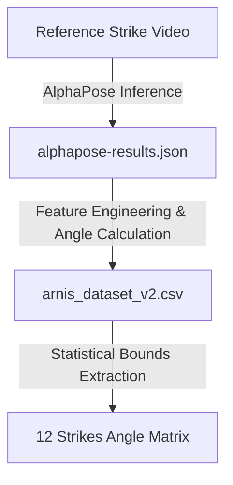

# ⚔️ PoseFix-Arnis: Real-Time Arnis Pose Evaluator & Trainer

PoseFix-Arnis is a cross-platform mobile application built with **React Native** and **Expo** designed to evaluate, grade, and refine your Arnis techniques in real-time. By utilizing **MediaPipe Pose** and custom computer vision algorithms, the app tracks both your skeletal landmarks and your training stick to provide immediate visual, numeric, and vocal feedback on the **12 Strikes of Arnis**.

---

## 🌟 Key Features

*   **🎥 Real-Time AI Pose Estimation:** Captures and overlays skeletal joint landmarks using on-device web-based AI inference.
*   **🎋 Stick Tracking Engine:** Integrates a pixel-level HSV color filtering system designed to detect and track different training stick colors (Rattan, Red, Blue, Green) to assess speed and alignment.
*   **📊 Multi-Angle Evaluation:** Computes right and left elbow angles dynamically and compares them to reference models extracted from expert dataset configurations.
*   **🗣️ Spoken Voice Coaching:** Implements real-time text-to-speech voice feedback (`expo-speech`) to tell you exactly how to adjust your form while you practice.
*   **💬 Interactive Coach Chatbot:** A built-in virtual coach assistant to answer training queries, explain the mechanical targets, and suggest form modifications.
*   **📈 Historical Analytics:** Tracks your evaluation session scores over time, displaying progress curves using custom SVG graphs.
*   **📚 12 Strikes Guide:** Includes an interactive list detailing the mechanical breakdown, target targets, and elbow angle boundaries for all 12 strikes of Arnis.

---

## 🛠️ Technology Stack

*   **Framework:** [Expo](https://expo.dev/) (v54) & [React Native](https://reactnative.dev/) (0.81.x)
*   **Navigation:** [Expo Router](https://docs.expo.dev/router/introduction/) (File-based Routing)
*   **AI Engine:** [MediaPipe Pose Landmarker](https://developers.google.com/mediapipe/solutions/vision/pose_landmarker) (embedded inside a high-performance `react-native-webview` sandbox)
*   **Audio Feedback:** [Expo Speech](https://docs.expo.dev/versions/latest/sdk/speech/) (Text-to-Speech)
*   **Charts & Diagrams:** Custom SVG renderings powered by `react-native-svg`
*   **Local Storage:** Key-value persistence with `@react-native-async-storage/async-storage`

---

## 📐 The 12 Strikes Angle Matrix

The application evaluates strikes based on the angular configuration of your elbows. Below is the reference criteria utilized by the evaluation engine:

| # | Strike Name | Target Area | Right Elbow Range | Left Elbow Range |
| :--- | :--- | :--- | :--- | :--- |
| **1** | Strike 1: Left Temple | Left Temple / Side of Neck | `92.3° - 150.8°` | `55.2° - 155.9°` |
| **2** | Strike 2: Right Temple | Right Temple / Side of Neck | `76.0° - 148.5°` | `33.0° - 65.3°` |
| **3** | Strike 3: Left Torso | Left Side of Torso / Shoulder | `72.6° - 113.7°` | `41.8° - 99.5°` |
| **4** | Strike 4: Right Torso | Right Side of Torso / Shoulder | `27.9° - 139.2°` | `29.6° - 61.0°` |
| **5** | Strike 5: Abdomen Thrust | Solar Plexus / Abdomen | `155.7° - 169.2°` | `40.4° - 81.2°` |
| **6** | Strike 6: Left Chest | Left Upper Chest / Shoulder | `93.2° - 155.2°` | `80.4° - 107.2°` |
| **7** | Strike 7: Right Chest | Right Upper Chest / Shoulder | `96.3° - 168.4°` | `50.7° - 118.8°` |
| **8** | Strike 8: Left Knee | Left Knee Joint / Lower Leg | `128.4° - 174.1°` | `27.7° - 98.2°` |
| **9** | Strike 9: Right Knee | Right Knee Joint / Lower Leg | `109.2° - 171.9°` | `41.1° - 123.3°` |
| **10** | Strike 10: Left Eye | Left Eye / Face Thrust | `112.7° - 153.0°` | `53.1° - 116.6°` |
| **11** | Strike 11: Right Eye | Right Eye / Face Thrust | `101.6° - 168.3°` | `48.2° - 133.7°` |
| **12** | Strike 12: Crown | Crown of the Skull (Overhead) | `90.0° - 130.2°` | `45.0° - 114.5°` |

---

## 📊 Dataset & Pose Processing Pipeline

The reference angles used by the evaluation engine are derived from expert performance footage processed through a custom data ingestion pipeline:



1. **Reference Video Capture:** High-fidelity reference videos of a professional martial artist executing each of the 12 Arnis strikes are recorded.
2. **Pose Extraction (AlphaPose):** The video frames are processed using [AlphaPose](https://github.com/MVIG-SJTU/AlphaPose) to estimate multi-person 2D poses. Keypoint estimates for each frame are exported in raw JSON format ([alphapose-results.json](https://drive.google.com/file/d/1hRK6yychyCg4dv7r54l913HYl8-VrRfU/view?usp=sharing)).
3. **Dataframe Conversion & Feature Extraction:** The JSON file is parsed to extract key skeletal points and compute explicit joint-to-joint vectors. Geometric features—including `R_Elbow_Angle`, `L_Elbow_Angle`, torso lean, and wrist distance ratios—are calculated and structured into a tabular CSV ([arnis_dataset_v2.csv](https://drive.google.com/file/d/1LdJVOjBHUpDfQcyt2IIsUsIm5psSl6Bn/view?usp=sharing)) for readability.
4. **Boundary Optimization:** The CSV dataset is analyzed to extract standard deviation-based upper and lower thresholds for the correct posture execution, defining the rule boundaries used by the real-time WebView evaluator.

---

## 📂 Project Structure

```text
arnis-trainer/
├── app/                  # Application Screens (Expo Router)
│   ├── (tabs)/           # Main tab-navigation flows
│   │   ├── _layout.tsx   # Custom Tab bar and theme setup
│   │   ├── index.tsx     # Home Screen / Dashboard
│   │   ├── evaluate.tsx  # Camera Evaluation & WebView AI integration
│   │   ├── explore.tsx   # 12 Strikes Reference Guide
│   │   ├── chat.tsx      # Coach chatbot screen
│   │   └── history.tsx   # Historical session log & analytics
│   └── _layout.tsx       # Root layout definition
├── assets/               # Local images, icons, and static assets
├── components/           # Shared React Native components
├── constants/            # Settings, themes, and data layers
│   ├── historyStore.ts   # AsyncStorage session logger helpers
│   ├── poseEngineHtml.ts # WebView HTML source hosting MediaPipe and Canvas detection
│   └── theme.ts          # Styling, palette, and typography configurations
├── scripts/              # Setup and housekeeping scripts
├── app.json              # Expo application configuration
├── package.json          # Package dependencies and scripts
└── tsconfig.json         # TypeScript configuration file
```

---

## 🚀 Getting Started

### Prerequisites

*   Node.js (v18 or higher recommended)
*   npm or yarn
*   Expo Go app on iOS/Android (optional, for device testing) or a configured Emulator (Android Studio / Xcode)

### Installation

1.  Clone the repository and navigate to the application directory:
    ```bash
    cd PoseFix-Arnis/arnis-trainer
    ```

2.  Install dependencies:
    ```bash
    npm install
    ```

### Run the App

1.  Start the Expo development server:
    ```bash
    npx expo start
    ```

2.  Select how you want to run the project:
    *   Press `a` for **Android emulator** or device.
    *   Press `i` for **iOS simulator** or device.
    *   Scan the QR code displayed in the terminal with your **Expo Go** application (iOS/Android) to test on a physical device.

---

## 🛡️ License

This project is proprietary and intended for evaluation and training purposes. All rights reserved.
